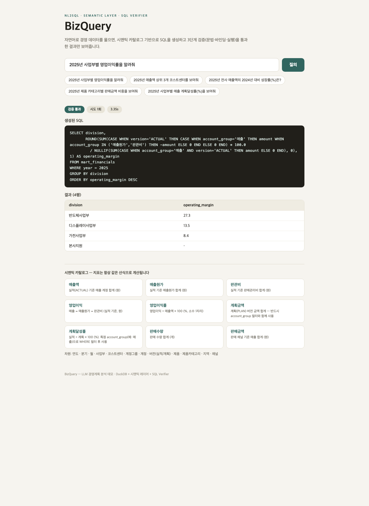
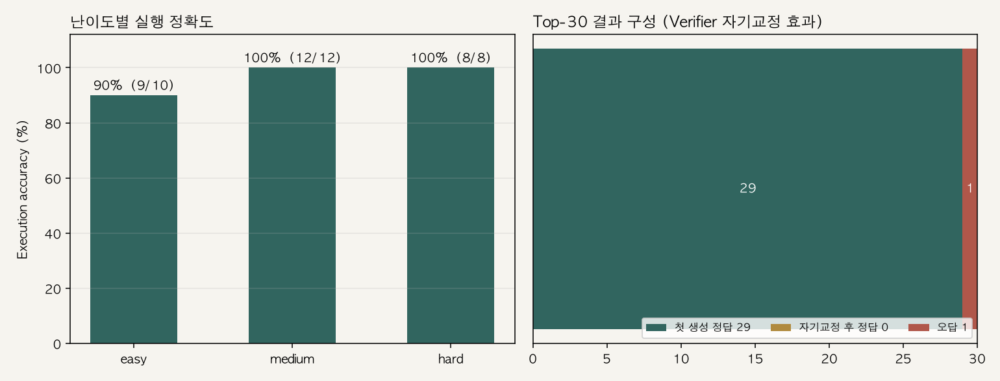

# BizQuery

자연어로 경영 데이터를 물어보면 SQL을 만들어서 답하는 시스템입니다.

LLM한테 그냥 SQL 짜달라고 하는 것과 다른 점은 두 가지입니다. 지표 정의를 시맨틱 카탈로그로
고정했고, 생성된 SQL은 3단계 검증을 통과해야만 실행됩니다. SAP CO 스타일 가상 데이터
(코스트센터 × 계정 × 실적/계획)로 실제 경영 질의 시나리오를 재현했습니다.



## 왜 이렇게 만들었나

NL2SQL을 실무 분석 시스템으로 쓰려고 하면 두 가지가 걸립니다.

**지표 정의가 매번 달라진다.** "영업이익률"을 물을 때마다 LLM이 다른 산식을 만들어내면
분석 시스템으로 쓸 수가 없습니다. 그래서 메트릭/디멘션 카탈로그(`semantic/catalog.yml`)를
지표 정의의 단일 출처로 두고, LLM은 카탈로그에 있는 SQL 산식을 그대로 쓰게 했습니다.
매출액은 항상 `account_group='매출' AND version='ACTUAL'` 조건으로만 계산됩니다.

**생성된 SQL을 그대로 믿을 수 없다.** LLM이 뱉은 SQL을 바로 실행하지 않습니다.
Verifier가 3단계로 걸러내고, 실패하면 오류 메시지를 피드백으로 넣어 다시 생성합니다(최대 2회).

```
질문 → [카탈로그 컨텍스트 주입] → LLM SQL 생성
     → Verifier ① 정적 검증 (sqlglot: 문법·SELECT-only·테이블 화이트리스트)
              ② 바인딩 검증 (EXPLAIN: 없는 컬럼/함수 적발)
              ③ 실행 + 정합성 (행수 상한·빈 결과·전부 NULL 경고)
     → 실패하면 오류를 피드백으로 재생성 (최대 2회)
     → 검증 통과한 SQL + 결과만 반환
```

## 평가

경영 질의 30개(easy 10 / medium 12 / hard 8)의 정답 SQL을 직접 짜두고, 실행 결과가
일치하는지 비교했습니다(execution accuracy). hard에는 전년비 성장률, 비중(윈도우 함수),
누적 합계, 사업부별 최대 계정(PARTITION BY) 같은 걸 넣었습니다.

| 지표 | 결과 |
|---|---|
| 실행 정확도 | 96.7% (29/30) |
| 난이도별 | easy 9/10 · medium 12/12 · hard 8/8 |
| 첫 생성에 정답 | 29건 (재시도 없이 통과) |
| 검증 실패·자기교정 발생 | 0건 |
| 평균 응답 | 2.1초/질의 (gpt-4.1-mini) |



틀린 1건(#4 "2025년 반도체사업부의 매출액은?")은 값 자체는 정답과 같은 1,562억원이
나왔는데, 요청하지도 않은 사업부명 컬럼을 하나 더 붙여서 컬럼 수 불일치로 오답 처리됐습니다.
수치가 틀린 답은 0건입니다. 비교 기준은 행 순서·컬럼 순서 무시, 수치는 소수 1자리 반올림이고
`src/eval.py`에 그대로 적어뒀습니다.

자기교정 루프는 이번 평가에서 한 번도 안 돌았습니다. 카탈로그 컨텍스트가 강해서 첫 생성
품질이 높았기 때문입니다. 애초에 스키마가 크고 지저분한 실환경에서 안전망 역할을 하라고
넣은 장치라, 일부러 깨진 질의를 넣어보면 정적/바인딩 단계에서 걸리고 재생성되는 건
확인했습니다.

## 데이터

실제 기업 데이터를 쓸 수 없어서 SAP CO(관리회계) 구조를 본뜬 가상 데이터를 결정적 시드로
생성합니다(`data/generate.py`). 3개 사업부 × 12개 코스트센터 × 10개 계정 × 30개월 ×
실적/계획 2버전(6,300행) + 제품 판매 마트(2,880행) 규모입니다. 사업부별 성장률·계절성·노이즈를
넣어서 전년비나 달성률 질의가 의미 있게 나오도록 했습니다. 팩트+차원 조인과 시간 파생 컬럼은
마트 뷰(`mart_financials`, `mart_sales`)로 빼뒀습니다.

## 실행

```bash
python3 -m venv .venv && source .venv/bin/activate
pip install -r requirements.txt
cp .env.example .env   # OPENAI_API_KEY 입력

python data/generate.py                 # 가상 데이터 생성 → data/bizquery.duckdb
python src/nl2sql.py "2025년 사업부별 영업이익률을 알려줘"   # CLI 단건 질의
python src/eval.py                      # Top-30 평가 (LLM 호출 발생)

# Web UI
uvicorn api:app --app-dir src --host 127.0.0.1 --port 8021   # API
cd web && npm install && npm run dev                          # React (proxy → 8021)
```

## 구조

```
BizQuery/
├── semantic/catalog.yml    시맨틱 레이어 (메트릭/디멘션/질의예시)
├── data/generate.py        SAP CO 스타일 가상 데이터 → DuckDB (마트 뷰 포함)
├── src/
│   ├── catalog.py          카탈로그 → LLM 프롬프트 컨텍스트
│   ├── nl2sql.py           생성 + 자기교정 루프
│   ├── verifier.py         3단계 SQL 검증 (sqlglot·EXPLAIN·실행)
│   ├── eval.py             Top-30 실행 정확도 평가
│   └── api.py              FastAPI 엔드포인트
├── web/                    React UI (질의·SQL·검증 배지·결과 테이블·카탈로그)
├── eval/questions.yml      질의 30개 + 정답 SQL
└── results/                평가 리포트·차트
```

## 한계

- 마트 2개 기준의 평가입니다. 테이블이 수십 개인 실환경이라면 스키마 검색(RAG)과 카탈로그
  분할 주입이 필요하고, 그때부터 자기교정 루프가 실제로 값을 합니다.
- 시맨틱 레이어가 자체 YAML 카탈로그입니다. dbt Semantic Layer / MetricFlow나 Power BI
  시맨틱 모델로 포팅할 수 있게 구조는 맞춰뒀습니다.
- 데이터 소스를 DuckDB에서 Microsoft Fabric(Lakehouse/Warehouse)으로 바꾸는 것과,
  Neo4j 기반 지표-조직 관계 그래프는 다음 작업으로 남겨뒀습니다.

## 스택

Python · DuckDB · sqlglot · OpenAI API (gpt-4.1-mini) · FastAPI · React(Vite) · matplotlib
